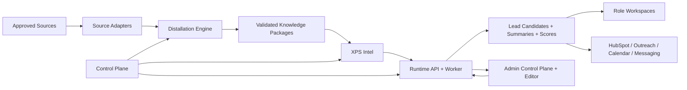

# XPS Enterprise Autonomy Blueprint

## Purpose
Define the target architecture for the XPS Intelligence platform as a Railway-first, Docker-local, GitHub-governed, enterprise-grade autonomous B2B/SaaS system.

## Product mission
Build an internal XPS intelligence platform that:
- ingests, validates, scores, summarizes, routes, and activates leads
- builds a unified industry intelligence substrate for epoxy, decorative concrete, polished concrete, coatings, equipment, tools, training, and franchise operations
- supports employee, manager, owner, and admin workspaces
- provides proactive role-based AI assistants with governed autonomy
- evolves into a reusable industry intelligence operating system

## Core product planes

### 1. Governance plane
Owned by `xps-intelligence-control-plane`.

Responsibilities:
- architecture law
- memory and rehydration
- prompt registry
- skills registry
- workflow templates
- CI/CD templates
- issue ladder
- benchmark gates
- environment contract
- guardrail definitions

### 2. Runtime plane
Owned by `xps-intelligence-system`.

Responsibilities:
- Next.js application
- API
- worker
- Railway-first auth
- role workspaces
- admin control plane
- operational frontend editing
- HubSpot activation
- user-facing assistant surfaces

### 3. Intelligence plane
Owned by `xps-intel`.

Responsibilities:
- industry taxonomy
- ontology
- benchmark packs
- seed registry
- strategic knowledge packs
- intelligence indexes
- prompt grounding artifacts

### 4. Distillation plane
Owned by `xps-distallation-system`.

Responsibilities:
- raw evidence intake contracts
- parsing
- normalization
- dedupe
- confidence scoring
- validation matrix
- distillation packaging
- freshness logic

### 5. Adapter plane
Owned by `xps-source-adapter-template` and downstream adapters.

Responsibilities:
- source configuration
- compliant crawling/search/import
- provenance capture
- handoff to distillation

### 6. Workspace bridge plane
Owned by `xps-google-workspace-bridge`.

Responsibilities:
- Gmail orchestration
- Calendar tasks/reminders
- note capture
- user workflow synchronization

### 7. Analytics plane
Owned by `xps-analytics-bi`.

Responsibilities:
- KPI dashboards
- forecasting
- benchmarking
- simulation
- scenario analysis
- promo and discount recommendations

### 8. Copilot plane
Owned by `xps-employee-copilots`.

Responsibilities:
- role-specific agents
- agent archetypes
- personality packs
- skills packs
- autonomy modes
- memory policies
- proactive messaging policies

## Canonical runtime architecture

## Canonical data flow
1. source registry
2. seed registry
3. crawl/search job
4. crawl run
5. raw source observation
6. parsed observation
7. canonical company and contact resolution
8. validation and enrichment
9. intelligence distillation package
10. lead candidate
11. scoring
12. recommendation
13. promotion to CRM
14. feedback loop into prompts, weights, and seed strategy

## Role model

### Employee
- owns assigned leads
- views summaries, recommendations, tasks, reminders
- can run governed search/crawl within allowed quotas
- can send AI-assisted email/SMS/call notes through approved channels

### Manager
- sees team-wide lead funnel
- assigns territory and routing
- monitors rep activity and stalled opportunities
- approves higher-risk promotions or strategy changes

### Owner
- sees organization-wide performance
- sees strategic trend, forecast, simulation, benchmark, and market expansion views
- configures business-level policies

### Admin
- controls connectors, prompts, agents, skills, memory policies, seeds, scoring weights, UI builder/editor, telemetry, usage, costs, model routing, and safety settings

## Autonomy model

### Minimal
- assistant recommends only
- no external writes without explicit user action

### Hybrid
- assistant can execute low-risk approved actions
- high-impact actions require approval

### Full
- assistant can operate within admin-defined allowlists, budgets, and guardrails
- high-impact actions still require explicit approval boundaries in production

## Memory architecture

### Durable memory layers
- workspace memory: `C:\XPS\AGENTS.md`
- platform memory: control-plane prompt memory
- repo memory: repo-level system memory files
- user memory: onboarding profile, role preferences, territory, communication style, playbooks
- organization memory: products, offerings, promo rules, objections, policies, territory map
- lead memory: lead facts, validation, score history, outreach history, call notes, recommendations
- agent memory: role scope, tools, preferences, recent traces, reflection outcomes

### Retrieval strategy
- relational truth in Postgres
- semantic indexes in vector store only for retrieval, not truth
- all strategic outputs cite provenance and freshness

## Safety and governance
- explicit tool allowlists
- role-based route protection
- trace logging for all agent actions
- approval gates for CRM activation, mass outreach, UI mutation, destructive actions, and policy changes
- secrets only through environment variables and secret stores
- nightly backups and restore rehearsals
- deployment smoke checks and rollback playbooks

## Reliability doctrine
- fail loud
- no fake integrations
- no silent retries without observability
- no direct raw observation to CRM write path
- every critical path must have tests, health, metrics, and fallback behavior

## Admin control plane requirements
- center editor and preview
- file and prompt editing within governed allowlists
- connector health
- agent registry
- prompt and skills registry
- crawler/source registry
- seed manager
- scoring weights
- recommendation policies
- autonomy policies
- cost and model routing dashboard
- safety toggles and kill switch

## Ceiling benchmark
Design the system the way a top-tier AI platform team would:
- GitHub as the engineering operating system
- strong evals and trace review
- governed tool use
- retrieval-backed assistants
- CI/CD with enforced quality gates
- cost-aware model routing
- built-in feedback loops
- operator-grade admin visibility
