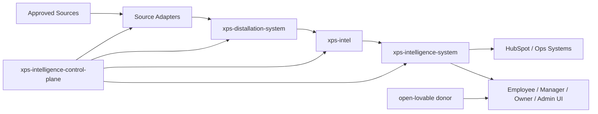

# XPS System Map

## Purpose
This document maps the major repositories, execution planes, and data flow for the XPS Intelligence platform.

## Execution planes
- GitHub = source of truth, issues, projects, workflows, automation governance
- Railway = deployed runtime plane
- Docker = local integration and validation plane
- Postgres = relational truth plane
- Redis = async queue and scheduling plane
- HubSpot = CRM action plane
- LLM providers = reasoning plane

## Repository map
- `xps-intelligence-control-plane` = governance, templates, validation, doc authority
- `xps-intelligence-system` = runtime host, UI, API, workers, role workspaces
- `xps-intel` = industry knowledge system, taxonomy, benchmarks, distillates
- `xps-distallation-system` = normalization, validation, enrichment, packaging
- `xps-ui` = shared UI and editor/design primitives
- `xps-source-adapter-template` = governed source adapter starter
- `xps-google-workspace-bridge` = Gmail, Calendar, reminders, note sync
- `xps-analytics-bi` = KPI, forecasting, benchmarking, simulation
- `xps-employee-copilots` = role assistants, skill packs, memory policies

## Core system flow

## Validation rule
No repository should drift from this map without updating the memory, index, and blueprint docs.
